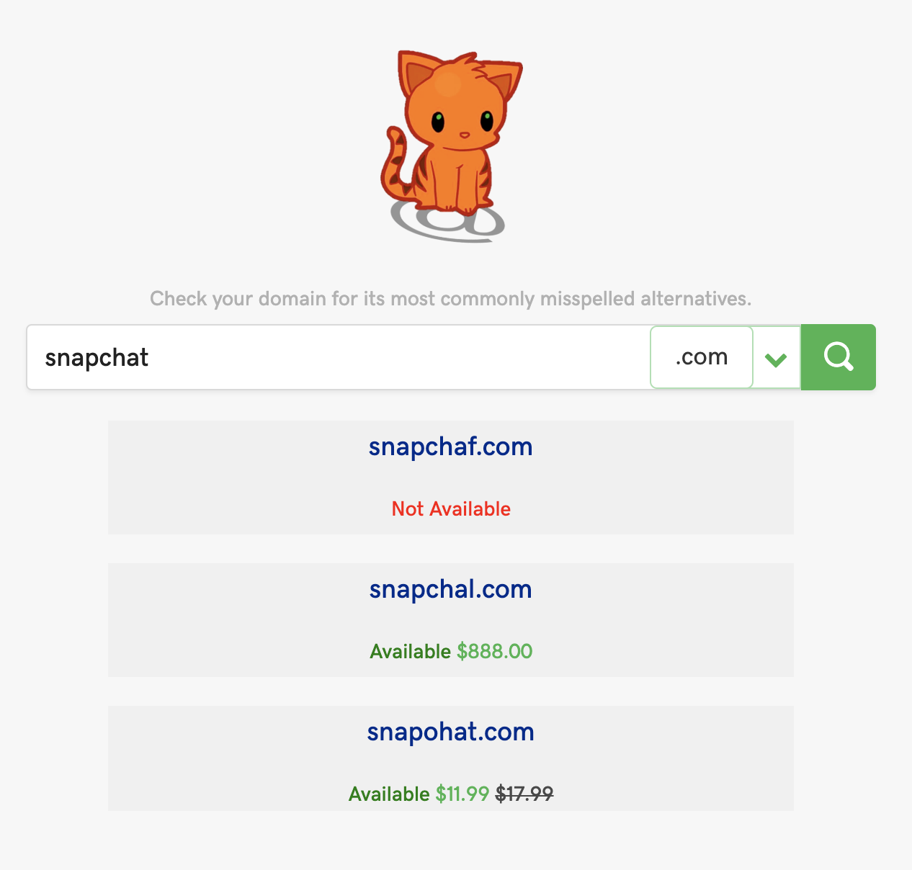

Siamese lets you explore domain names for awareness and potential prevention of [typosquatting](https://en.wikipedia.org/wiki/Typosquatting). Provide a domain name, and Siamese returns a list of similar domain names that are likely to be used for typosquatting.

All returned domain names come with information on whether or not that domain name is available. If a domain name is not available, it may be worth it to research the associated web site to check if it's exhibiting malicious behavior that is characteristic of typosquatters. If a domain name is available for purchase, its price is shown. Click on the domain name to be taken to GoDaddy's purchase page for that domain name.

# Running locally

1. Clone and `cd` into this repository.
2. `./run.sh`
3. View locally at [http://localhost:5000/](http://localhost:5000/).

# About

Project Siamese was planned and implemented from start to finish in one day by Team Kittens for GoDaddy's 2019 Intern Week hackathon.

## Team Kittens

- [Joonho Ko](https://github.com/simpko/)
- [Alex Yang](https://github.com/yangalexandery)
- [Jeana Choi](https://github.com/jchoi614)
- [Jeff Chow](https://github.com/jefftienchow)
